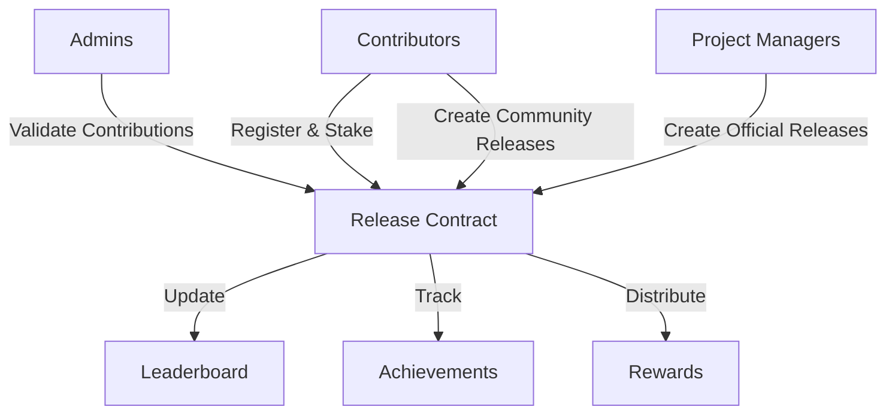

# Release Management Module

A blockchain-powered platform for tracking and rewarding software release contributions on a decentralized network.

## Overview

Release Module enables teams and open-source contributors to manage, track, and incentivize software release efforts through transparent, blockchain-based contribution tracking. The platform features:

- Creation and management of release campaigns
- Verified contribution tracking through trusted contributors
- Automated reward distribution based on achievement
- Real-time contribution leaderboards
- Both official and community-driven release efforts
- Stake-to-participate mechanism

## Architecture

The Release Module system is built around a core smart contract that handles:



### Core Components:
- Release Campaign Management
- Contributor Registration
- Contribution Verification
- Achievement Tracking
- Reward Distribution
- Contribution Leaderboard

## Contract Documentation

### Release Management Contract (`release-management.clar`)

The main contract managing the entire Release Module ecosystem.

#### Key Features:
- Role-based access control (Admin, Contributor)
- Release campaign creation and management
- Contributor registration and tracking
- Contribution data submission and verification
- Achievement tracking
- Automated reward distribution
- Real-time contribution leaderboard updates

#### Access Control
- Contract Owner: Full administrative control
- Admins: Can create official release campaigns
- Contributors: Participate in release efforts
- Project Managers: Validate and track contributions

## Getting Started

### Prerequisites
- Clarinet
- Stacks wallet
- STX tokens for participation

### Basic Usage

1. **Creating a Release Campaign**
```clarity
(contract-call? .release-management create-release-campaign
    "Q3 Major Release"
    "Comprehensive feature release for core product"
    false  ;; community release
    u1234567890  ;; start time
    u1237246290  ;; end time
    u50000  ;; contribution goal
    u100  ;; max contributors
    u100000000  ;; entry fee in microSTX
    u0)  ;; initial reward pool
```

2. **Registering for a Release**
```clarity
(contract-call? .release-management register-for-release u1)
```

3. **Submitting Contribution Data**
```clarity
(contract-call? .release-management submit-contribution 
    u1  ;; release-id
    tx-sender  ;; contributor
    u5000  ;; contribution value
    "Feature implementation")  ;; contribution description
```

4. **Claiming Rewards**
```clarity
(contract-call? .release-management claim-rewards u1)
```

## Function Reference

### Administrative Functions
- `set-contract-owner`: Update contract owner
- `grant-role`: Assign roles to addresses
- `revoke-role`: Remove roles from addresses

### Release Management
- `create-release-campaign`: Initiate new release effort
- `end-release`: Conclude an active release campaign
- `add-to-reward-pool`: Increase campaign rewards

### Contributor Functions
- `register-for-release`: Join a release campaign
- `submit-contribution`: Log development efforts
- `claim-rewards`: Collect earned rewards

### Read-Only Functions
- `get-release`: Retrieve release campaign details
- `get-contributor-data`: Get contributor statistics
- `get-leaderboard`: View contribution rankings
- `get-achievements`: Check contributor milestones

## Development

### Testing
```bash
# Run contract tests
clarinet test

# Check contract deployment
clarinet console
```

### Local Development
1. Clone the repository
2. Install Clarinet
3. Deploy contracts locally:
```bash
clarinet deploy --local
```

## Security Considerations

### Known Limitations
- Relies on trusted contributor validation
- Leaderboard limited to top 50 contributors
- Release campaign duration constraints (1-30 days)

### Best Practices
- Verify release parameters before participation
- Wait for transaction confirmation before UI updates
- Monitor contribution submissions for consistency
- Review reward calculations before claiming

### Risk Mitigation
- Contribution data must be incrementally validated
- Rewards locked until release completion
- Role-based access control for critical functions
- Release parameters validated at campaign creation